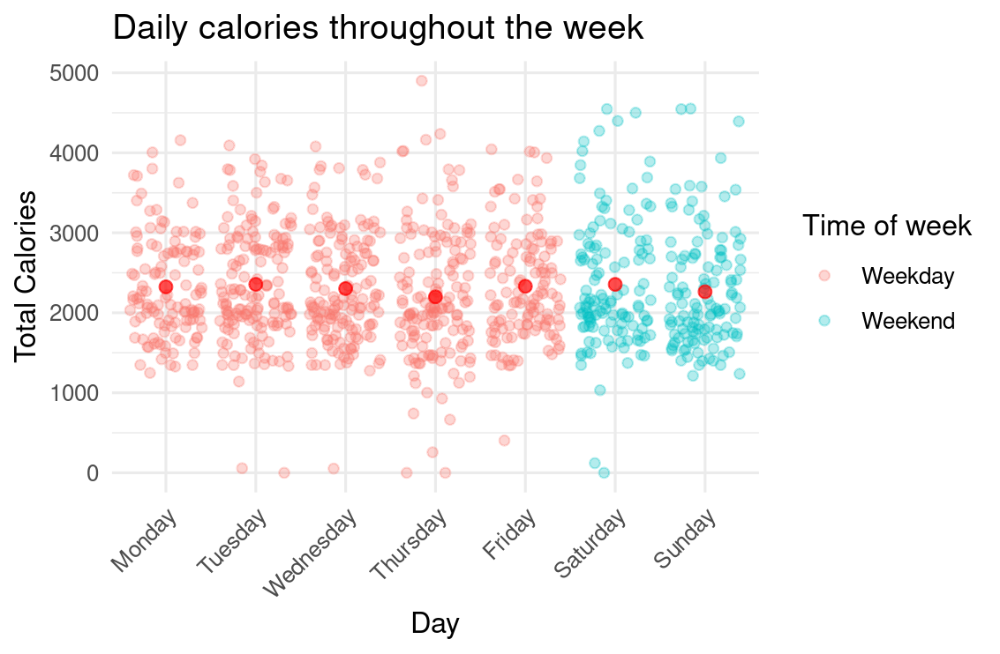
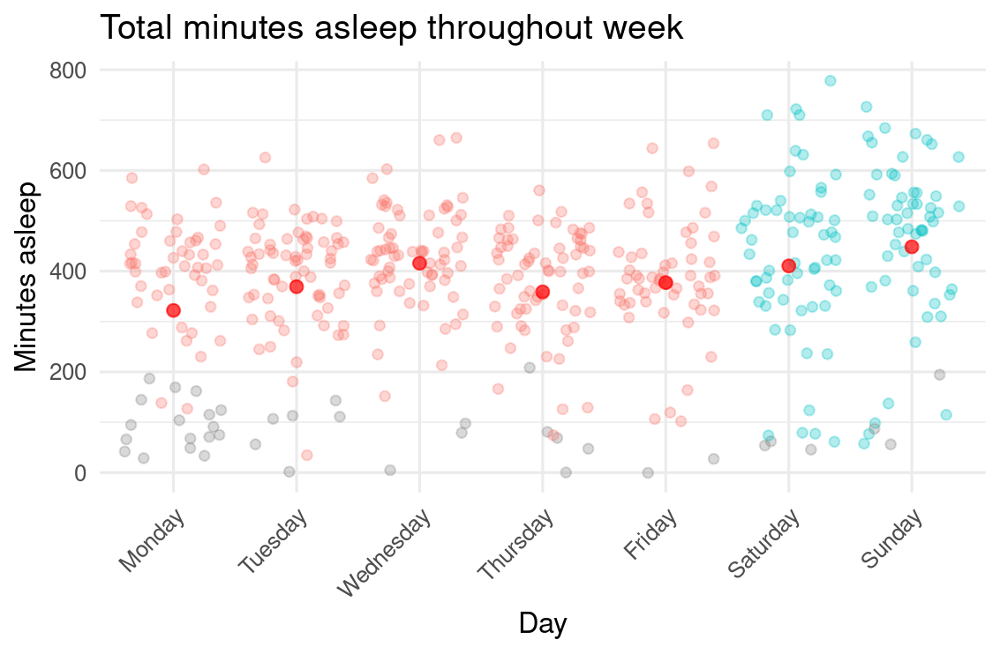
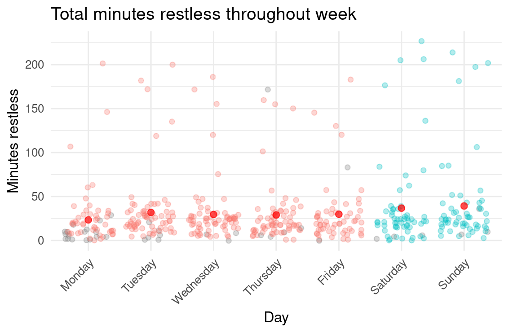
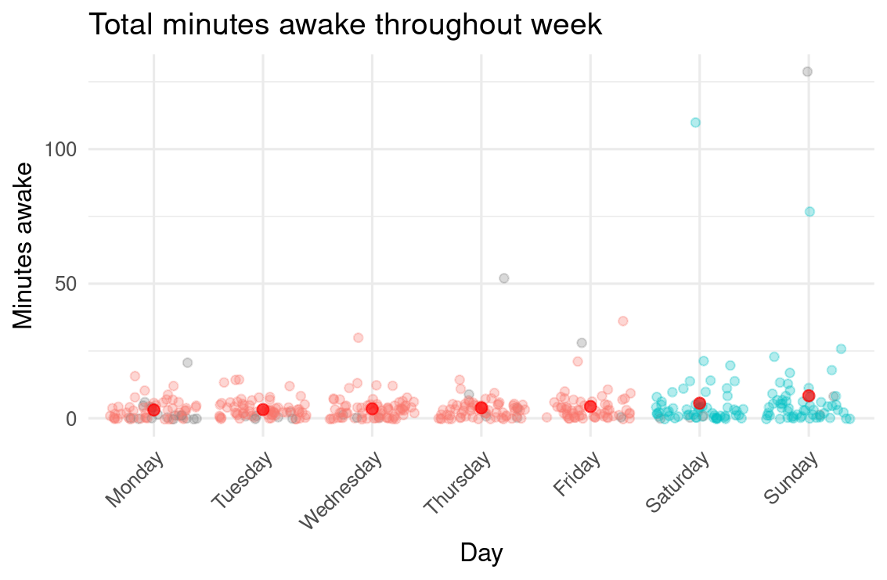
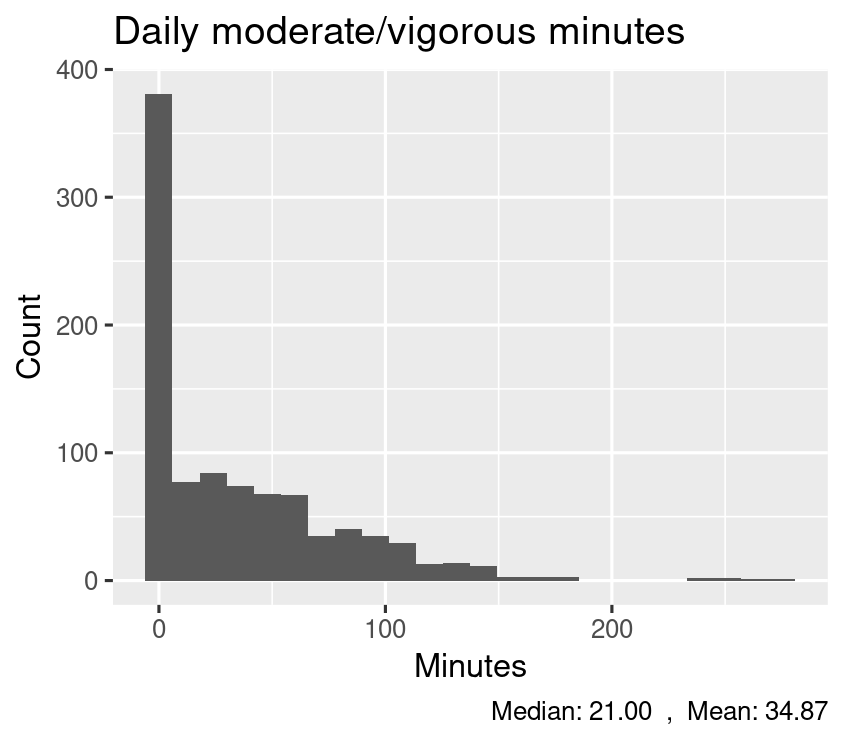
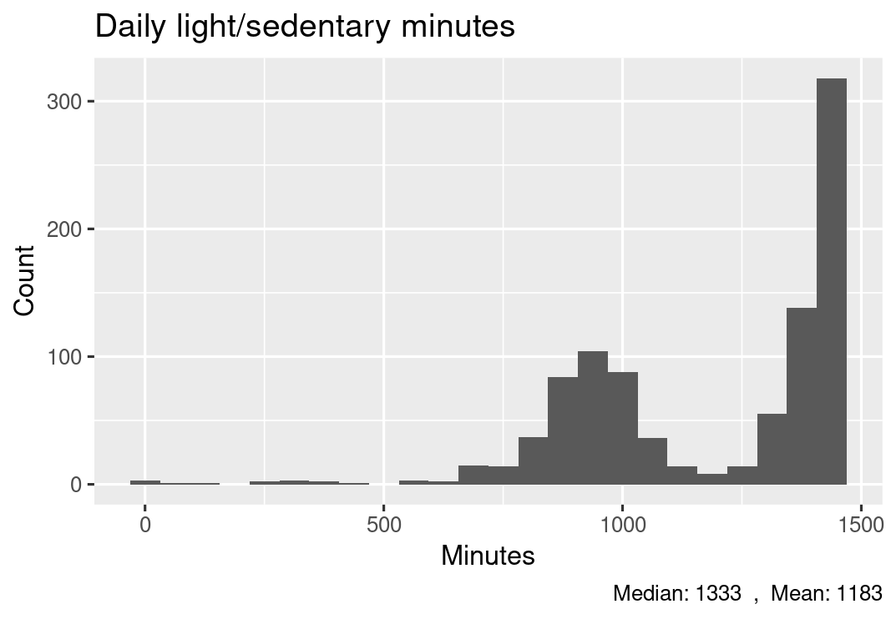
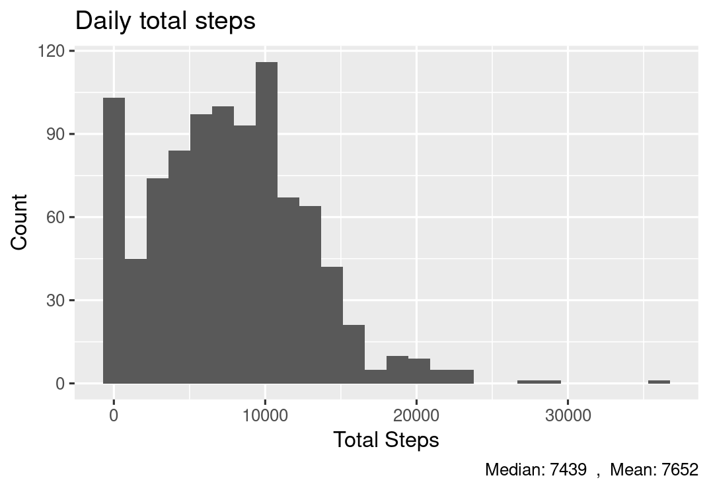
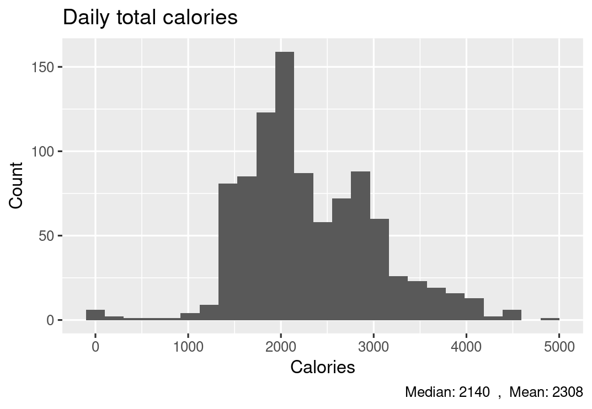
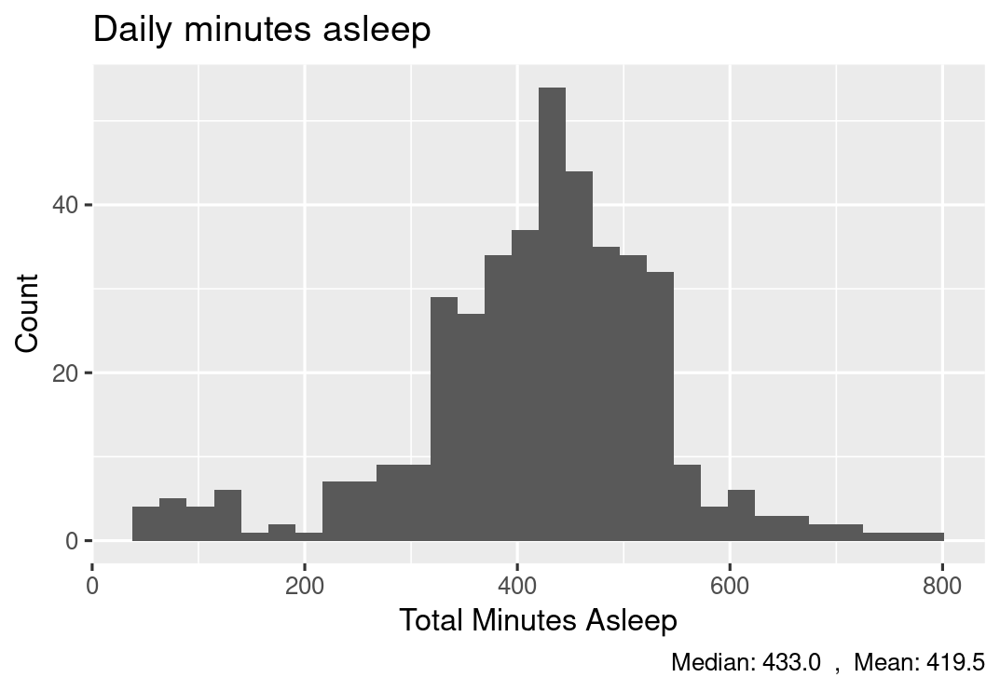

# Case Study: Unraveling User Behavior with Bellabeat Data

# Introduction

This repository presents a comprehensive case study on Bellabeat, a fictional wellness company. By leveraging the power of R programming, we delve into a dataset containing various user metrics such as activity levels, sleep patterns, and calories burned. The primary objective of this study is to gain valuable insights into user behavior and preferences, ultimately informing product development and marketing strategies.
## 📕 Table Of Contents
* [SCENARIO](#scenario)
* [ASK](#ask)
* [PREPARE](#prepare)
* [PROCESS](#process)
* [ANALYZE](#analyze)
* [ACT](#act)

## SCENARIO
Bellabeat, a high-tech company that manufactures health-focused smart products wants to analyse the usage of one of their products in order to gain insight into how people are already using their smart devices.Then, using this information, she would like high-level recommendations for how these trends can inform Bellabeat marketing strategy.

## ASK

**Business Tasks**

Analyze smart device usage data to understand consumer behavior with non-Bellabeat devices and apply these insights to enhance a Bellabeat product.

**Key stakeholders**

> 1. Urška Sršen: Bellabeat’s co founder and Chief Creative Officer;
> 2. Sando Mur: Mathematician and Bellabeat cofounder; key member of the Bellabeat executive team;
> 3. Bellabeat marketing analytics team: A team of data analysts responsible for collecting, analyzing, and reporting data that helps guide Bellabeat’s marketing strategy.

> - Question to guide the analysis:
>    1.  What are some trends in smart device usage?
>    2.  How could these trends apply to Bellabeat customers?
>    3.  How could these trends help influence Bellabeat marketing strategy?

## PREPARE
**Evaluating Data Validity**

For this case study, we'll analyze public FitBit Fitness Tracker data sourced from Kaggle, comprising personal fitness information voluntarily shared by participants. The dataset presents a comprehensive snapshot of user activity and wellness metrics.
> 1. Reliability: The dataset includes data from 30 FitBit users, meeting the minimum sample size requirement for analysis.
> 2. Originality: The data was collected by a third party through Amazon Mechanical Turk surveys.
> 3. Comprehensiveness: It covers various metrics, including daily active time, activity minutes, sleep duration, step counts, and distance covered.
> 4. Current: The data spans one month, from 4/12/2016 to 5/12/2016.
> 5. Citations: The original source is unspecified as the data was collected by a third party.

``` r
#install packages 
install.packages('tidyverse')
library(tidyverse)
install.packages('lubridate')
library(lubridate)
install.packages('ggplot2')
library(ggplot2)
library(dplyr)
library(knitr)
```
``` r
    ── Attaching core tidyverse packages ──────────────── tidyverse 2.0.0 ──
✔ dplyr     1.1.4     ✔ readr     2.1.5
✔ forcats   1.0.0     ✔ stringr   1.5.1
✔ ggplot2   3.5.1     ✔ tibble    3.2.1
✔ lubridate 1.9.3     ✔ tidyr     1.3.1
✔ purrr     1.0.2     
── Conflicts ────────────────────────────────── tidyverse_conflicts() ──
✖ dplyr::filter() masks stats::filter()
✖ dplyr::lag()    masks stats::lag()
ℹ Use the conflicted package to force all conflicts to become errors
```

**Importing data**

We’re going to explore data across 18 CSV files. These files track different metrics at three distinct time intervals:
> 1. Daily summaries, 
> 2. Hourly breakdowns
> 3. Minute-by-minute records

The data follows a long format structure, where each session ID appears across multiple rows, with each row representing a single time point. We can identify individual reports using either their export ID or timestamp. 

By examining patterns across these different time scales, we aim to uncover insights that could benefit Bellabeat's customer base. Let’s start with loading our daily and hourly datasets. We’ll create dataframes for these now:

``` r
#Importing data
daily_activity <- read_csv("dailyActivity_merged.csv")
```
``` r
Rows: 940 Columns: 15                                                   
── Column specification ────────────────────────────────────────────────
Delimiter: ","
chr  (1): ActivityDate
dbl (14): Id, TotalSteps, TotalDistance, TrackerDistance, LoggedActi...

ℹ Use `spec()` to retrieve the full column specification for this data.
ℹ Specify the column types or set `show_col_types = FALSE` to quiet this message.
Session restored from your saved work on 2024-Dec-05 18:37:10 UTC (1 hour ago)
```

``` r
daily_calories <- read_csv("dailyCalories_merged.csv")
```
``` r
Rows: 940 Columns: 3                                                    
── Column specification ────────────────────────────────────────────────
Delimiter: ","
chr (1): ActivityDay
dbl (2): Id, Calories

ℹ Use `spec()` to retrieve the full column specification for this data.
ℹ Specify the column types or set `show_col_types = FALSE` to quiet this message.
```

``` r
daily_intensities <- read_csv("dailyIntensities_merged.csv")
```
``` r
Rows: 940 Columns: 10                                                   
── Column specification ────────────────────────────────────────────────
Delimiter: ","
chr (1): ActivityDay
dbl (9): Id, SedentaryMinutes, LightlyActiveMinutes, FairlyActiveMin...

ℹ Use `spec()` to retrieve the full column specification for this data.
ℹ Specify the column types or set `show_col_types = FALSE` to quiet this message.
```
``` r
daily_steps <- read_csv("dailySteps_merged.csv")
```
``` r
Rows: 940 Columns: 3                                                    
── Column specification ────────────────────────────────────────────────
Delimiter: ","
chr (1): ActivityDay
dbl (2): Id, StepTotal

ℹ Use `spec()` to retrieve the full column specification for this data.
ℹ Specify the column types or set `show_col_types = FALSE` to quiet this message.
```

``` r
daily_sleep <- read_csv("sleepDay_merged.csv")
```
``` r
Rows: 413 Columns: 5                                                    
── Column specification ────────────────────────────────────────────────
Delimiter: ","
chr (1): SleepDay
dbl (4): Id, TotalSleepRecords, TotalMinutesAsleep, TotalTimeInBed

ℹ Use `spec()` to retrieve the full column specification for this data.
ℹ Specify the column types or set `show_col_types = FALSE` to quiet this message.
```

``` r
weight_log <- read_csv("weightLogInfo_merged.csv")
```
``` r
Rows: 67 Columns: 8                                                     
── Column specification ────────────────────────────────────────────────
Delimiter: ","
chr (1): Date
dbl (6): Id, WeightKg, WeightPounds, Fat, BMI, LogId
lgl (1): IsManualReport

ℹ Use `spec()` to retrieve the full column specification for this data.
ℹ Specify the column types or set `show_col_types = FALSE` to quiet this message.
```

``` r
hourly_calories <- read_csv("hourlyCalories_merged.csv")
```
``` r
Rows: 22099 Columns: 3                                                  
── Column specification ────────────────────────────────────────────────
Delimiter: ","
chr (1): ActivityHour
dbl (2): Id, Calories

ℹ Use `spec()` to retrieve the full column specification for this data.
ℹ Specify the column types or set `show_col_types = FALSE` to quiet this message.
```

``` r
hourly_intensities <- read_csv("hourlyIntensities_merged.csv")
```
``` r
Rows: 22099 Columns: 4                                                  
── Column specification ────────────────────────────────────────────────
Delimiter: ","
chr (1): ActivityHour
dbl (3): Id, TotalIntensity, AverageIntensity

ℹ Use `spec()` to retrieve the full column specification for this data.
ℹ Specify the column types or set `show_col_types = FALSE` to quiet this message.
```
``` r
hourly_steps <- read_csv("hourlySteps_merged.csv")
```
``` r
Rows: 22099 Columns: 3                                                  
── Column specification ────────────────────────────────────────────────
Delimiter: ","
chr (1): ActivityHour
dbl (2): Id, StepTotal

ℹ Use `spec()` to retrieve the full column specification for this data.
ℹ Specify the column types or set `show_col_types = FALSE` to quiet this message.
```
``` r
#Since the minute data is huge, we’re only going to import the smallest dataset:

minute_sleep <- read_csv("minuteSleep_merged.csv")
```
``` r
Rows: 188521 Columns: 4                                                 
── Column specification ────────────────────────────────────────────────
Delimiter: ","
chr (1): date
dbl (3): Id, value, logId

ℹ Use `spec()` to retrieve the full column specification for this data.
ℹ Specify the column types or set `show_col_types = FALSE` to quiet this message.
```
## Process

**Clean Data**: To ensure data quality and consistency, we'll clean and tidy the datasets. This involves handling missing values, outliers, and inconsistencies in data formats.

**Create tibbles** : Let’s take a closer look at the different dataframes. We’ll start by using the head() function to view the first few rows of each one:

**Daily dataframes**
``` r
head(daily_activity)
```
``` r
# A tibble: 6 × 15
          Id ActivityDate TotalSteps TotalDistance TrackerDistance LoggedActivitiesDist…¹
       <dbl> <chr>             <dbl>         <dbl>           <dbl>                  <dbl>
1 1503960366 4/12/2016         13162          8.5             8.5                       0
2 1503960366 4/13/2016         10735          6.97            6.97                      0
3 1503960366 4/14/2016         10460          6.74            6.74                      0
4 1503960366 4/15/2016          9762          6.28            6.28                      0
5 1503960366 4/16/2016         12669          8.16            8.16                      0
6 1503960366 4/17/2016          9705          6.48            6.48                      0
# ℹ abbreviated name: ¹​LoggedActivitiesDistance
# ℹ 9 more variables: VeryActiveDistance <dbl>, ModeratelyActiveDistance <dbl>,
#   LightActiveDistance <dbl>, SedentaryActiveDistance <dbl>, VeryActiveMinutes <dbl>,
#   FairlyActiveMinutes <dbl>, LightlyActiveMinutes <dbl>, SedentaryMinutes <dbl>,
#   Calories <dbl>
```
``` r
head(daily_calories)
```
``` r
# A tibble: 6 × 3
          Id ActivityDay Calories
       <dbl> <chr>          <dbl>
1 1503960366 4/12/2016       1985
2 1503960366 4/13/2016       1797
3 1503960366 4/14/2016       1776
4 1503960366 4/15/2016       1745
5 1503960366 4/16/2016       1863
6 1503960366 4/17/2016       1728
```
``` r
head(daily_intensities)
```
``` r
# A tibble: 6 × 10
          Id ActivityDay SedentaryMinutes LightlyActiveMinutes FairlyActiveMinutes
       <dbl> <chr>                  <dbl>                <dbl>               <dbl>
1 1503960366 4/12/2016                728                  328                  13
2 1503960366 4/13/2016                776                  217                  19
3 1503960366 4/14/2016               1218                  181                  11
4 1503960366 4/15/2016                726                  209                  34
5 1503960366 4/16/2016                773                  221                  10
6 1503960366 4/17/2016                539                  164                  20
# ℹ 5 more variables: VeryActiveMinutes <dbl>, SedentaryActiveDistance <dbl>,
#   LightActiveDistance <dbl>, ModeratelyActiveDistance <dbl>, VeryActiveDistance <dbl>
```
``` r
head(daily_steps)
```
``` r
# A tibble: 6 × 3
          Id ActivityDay StepTotal
       <dbl> <chr>           <dbl>
1 1503960366 4/12/2016       13162
2 1503960366 4/13/2016       10735
3 1503960366 4/14/2016       10460
4 1503960366 4/15/2016        9762
5 1503960366 4/16/2016       12669
6 1503960366 4/17/2016        9705
```
``` r
head(daily_sleep)
```
``` r
# A tibble: 6 × 5
          Id SleepDay              TotalSleepRecords TotalMinutesAsleep TotalTimeInBed
       <dbl> <chr>                             <dbl>              <dbl>          <dbl>
1 1503960366 4/12/2016 12:00:00 AM                 1                327            346
2 1503960366 4/13/2016 12:00:00 AM                 2                384            407
3 1503960366 4/15/2016 12:00:00 AM                 1                412            442
4 1503960366 4/16/2016 12:00:00 AM                 2                340            367
5 1503960366 4/17/2016 12:00:00 AM                 1                700            712
6 1503960366 4/19/2016 12:00:00 AM                 1                304            320
```
``` r
head(weight_log)
```
``` r
# A tibble: 6 × 8
          Id Date                WeightKg WeightPounds   Fat   BMI IsManualReport   LogId
       <dbl> <chr>                  <dbl>        <dbl> <dbl> <dbl> <lgl>            <dbl>
1 1503960366 5/2/2016 11:59:59 …     52.6         116.    22  22.6 TRUE           1.46e12
2 1503960366 5/3/2016 11:59:59 …     52.6         116.    NA  22.6 TRUE           1.46e12
3 1927972279 4/13/2016 1:08:52 …    134.          294.    NA  47.5 FALSE          1.46e12
4 2873212765 4/21/2016 11:59:59…     56.7         125.    NA  21.5 TRUE           1.46e12
5 2873212765 5/12/2016 11:59:59…     57.3         126.    NA  21.7 TRUE           1.46e12
6 4319703577 4/17/2016 11:59:59…     72.4         160.    25  27.5 TRUE           1.46e12
```
``` r
head(weight_log)
```
``` r
# A tibble: 6 × 8
          Id Date                WeightKg WeightPounds   Fat   BMI IsManualReport   LogId
       <dbl> <chr>                  <dbl>        <dbl> <dbl> <dbl> <lgl>            <dbl>
1 1503960366 5/2/2016 11:59:59 …     52.6         116.    22  22.6 TRUE           1.46e12
2 1503960366 5/3/2016 11:59:59 …     52.6         116.    NA  22.6 TRUE           1.46e12
3 1927972279 4/13/2016 1:08:52 …    134.          294.    NA  47.5 FALSE          1.46e12
4 2873212765 4/21/2016 11:59:59…     56.7         125.    NA  21.5 TRUE           1.46e12
5 2873212765 5/12/2016 11:59:59…     57.3         126.    NA  21.7 TRUE           1.46e12
6 4319703577 4/17/2016 11:59:59…     72.4         160.    25  27.5 TRUE           1.46e12
```
**Hourly dataframes**
``` r
head(hourly_calories)
```
``` r
# A tibble: 6 × 3
          Id ActivityHour          Calories
       <dbl> <chr>                    <dbl>
1 1503960366 4/12/2016 12:00:00 AM       81
2 1503960366 4/12/2016 1:00:00 AM        61
3 1503960366 4/12/2016 2:00:00 AM        59
4 1503960366 4/12/2016 3:00:00 AM        47
5 1503960366 4/12/2016 4:00:00 AM        48
6 1503960366 4/12/2016 5:00:00 AM        48
```
``` r
head(hourly_intensities)
```
``` r
# A tibble: 6 × 4
          Id ActivityHour          TotalIntensity AverageIntensity
       <dbl> <chr>                          <dbl>            <dbl>
1 1503960366 4/12/2016 12:00:00 AM             20            0.333
2 1503960366 4/12/2016 1:00:00 AM               8            0.133
3 1503960366 4/12/2016 2:00:00 AM               7            0.117
4 1503960366 4/12/2016 3:00:00 AM               0            0    
5 1503960366 4/12/2016 4:00:00 AM               0            0    
6 1503960366 4/12/2016 5:00:00 AM               0            0  
```
``` r
head(hourly_steps)
```
``` r
# A tibble: 6 × 3
          Id ActivityHour          StepTotal
       <dbl> <chr>                     <dbl>
1 1503960366 4/12/2016 12:00:00 AM       373
2 1503960366 4/12/2016 1:00:00 AM        160
3 1503960366 4/12/2016 2:00:00 AM        151
4 1503960366 4/12/2016 3:00:00 AM          0
5 1503960366 4/12/2016 4:00:00 AM          0
6 1503960366 4/12/2016 5:00:00 AM          0
```
**Minute dataframe**:
``` r
head(minute_sleep)
```
``` r
# A tibble: 6 × 4
          Id date                 value       logId
       <dbl> <chr>                <dbl>       <dbl>
1 1503960366 4/12/2016 2:47:30 AM     3 11380564589
2 1503960366 4/12/2016 2:48:30 AM     2 11380564589
3 1503960366 4/12/2016 2:49:30 AM     1 11380564589
4 1503960366 4/12/2016 2:50:30 AM     1 11380564589
5 1503960366 4/12/2016 2:51:30 AM     1 11380564589
6 1503960366 4/12/2016 2:52:30 AM     1 11380564589
```
**View column names**: Now we’ll use the colnames() function to view the column names for each dataframe
**Daily dataframes**:
``` r
colnames(daily_activity)
```
``` r
[1] "Id"                       "ActivityDate"             "TotalSteps"              
 [4] "TotalDistance"            "TrackerDistance"          "LoggedActivitiesDistance"
 [7] "VeryActiveDistance"       "ModeratelyActiveDistance" "LightActiveDistance"     
[10] "SedentaryActiveDistance"  "VeryActiveMinutes"        "FairlyActiveMinutes"     
[13] "LightlyActiveMinutes"     "SedentaryMinutes"         "Calories"
```
``` r
colnames(daily_calories)
```
``` r
[1] "Id"          "ActivityDay" "Calories"  
```
``` r
colnames(daily_intensities)
```
``` r
 [1] "Id"                       "ActivityDay"              "SedentaryMinutes"        
 [4] "LightlyActiveMinutes"     "FairlyActiveMinutes"      "VeryActiveMinutes"       
 [7] "SedentaryActiveDistance"  "LightActiveDistance"      "ModeratelyActiveDistance"
[10] "VeryActiveDistance"
```
``` r
colnames(daily_steps)
```
``` r
[1] "Id"          "ActivityDay" "StepTotal" 
```
``` r
colnames(daily_sleep)
```
``` r
[1] "Id"                 "SleepDay"           "TotalSleepRecords"  "TotalMinutesAsleep"
[5] "TotalTimeInBed"
```
``` r
colnames(weight_log)
```
``` r
[1] "Id"             "Date"           "WeightKg"       "WeightPounds"   "Fat"           
[6] "BMI"            "IsManualReport" "LogId"
```
**Hourly dataframes**:
``` r
colnames(hourly_calories)
```
``` r
[1] "Id"           "ActivityHour" "Calories" 
```
``` r
colnames(hourly_intensities)
```
``` r
[1] "Id"               "ActivityHour"     "TotalIntensity"   "AverageIntensity"
```
``` r
colnames(hourly_steps)
```
``` r
[1] "Id"           "ActivityHour" "StepTotal"   
```
```
**Minute dataframes**:

``` r
colnames(minute_sleep)
```
``` r
[1] "Id"    "date"  "value" "logId"
```
**Viewing Variables**

Each dataframe contains an **Id field**, which can serve as a key to merge them into comprehensive datasets (e.g., daily or hourly dataframes). However, the formatting of the activity date/time variables appears inconsistent across some dataframes. To investigate further, we use the select() function to isolate and examine these variables more closely.
``` r
daily_activity %>%
  select(Id, ActivityDate)
```

``` r
# A tibble: 940 × 2
           Id ActivityDate
        <dbl> <chr>       
 1 1503960366 4/12/2016   
 2 1503960366 4/13/2016   
 3 1503960366 4/14/2016   
 4 1503960366 4/15/2016   
 5 1503960366 4/16/2016   
 6 1503960366 4/17/2016   
 7 1503960366 4/18/2016   
 8 1503960366 4/19/2016   
 9 1503960366 4/20/2016   
10 1503960366 4/21/2016   
# ℹ 930 more rows
# ℹ Use `print(n = ...)` to see more rows
```
``` r
daily_calories %>%
  select(Id, ActivityDay)
```
``` r
# A tibble: 940 × 2
           Id ActivityDay
        <dbl> <chr>      
 1 1503960366 4/12/2016  
 2 1503960366 4/13/2016  
 3 1503960366 4/14/2016  
 4 1503960366 4/15/2016  
 5 1503960366 4/16/2016  
 6 1503960366 4/17/2016  
 7 1503960366 4/18/2016  
 8 1503960366 4/19/2016  
 9 1503960366 4/20/2016  
10 1503960366 4/21/2016  
# ℹ 930 more rows
# ℹ Use `print(n = ...)` to see more rows
```
``` r
daily_intensities %>%
select(Id, ActivityDay)
```
``` r
# A tibble: 940 × 2
           Id ActivityDay
        <dbl> <chr>      
 1 1503960366 4/12/2016  
 2 1503960366 4/13/2016  
 3 1503960366 4/14/2016  
 4 1503960366 4/15/2016  
 5 1503960366 4/16/2016  
 6 1503960366 4/17/2016  
 7 1503960366 4/18/2016  
 8 1503960366 4/19/2016  
 9 1503960366 4/20/2016  
10 1503960366 4/21/2016  
# ℹ 930 more rows
# ℹ Use `print(n = ...)` to see more rows
```
``` r
daily_steps %>%
select(Id, ActivityDay)
```
``` r
# A tibble: 940 × 2
           Id ActivityDay
        <dbl> <chr>      
 1 1503960366 4/12/2016  
 2 1503960366 4/13/2016  
 3 1503960366 4/14/2016  
 4 1503960366 4/15/2016  
 5 1503960366 4/16/2016  
 6 1503960366 4/17/2016  
 7 1503960366 4/18/2016  
 8 1503960366 4/19/2016  
 9 1503960366 4/20/2016  
10 1503960366 4/21/2016  
# ℹ 930 more rows
# ℹ Use `print(n = ...)` to see more rows
```
``` r
daily_sleep %>%
select(Id, SleepDay)
```
``` r
# A tibble: 413 × 2
           Id SleepDay             
        <dbl> <chr>                
 1 1503960366 4/12/2016 12:00:00 AM
 2 1503960366 4/13/2016 12:00:00 AM
 3 1503960366 4/15/2016 12:00:00 AM
 4 1503960366 4/16/2016 12:00:00 AM
 5 1503960366 4/17/2016 12:00:00 AM
 6 1503960366 4/19/2016 12:00:00 AM
 7 1503960366 4/20/2016 12:00:00 AM
 8 1503960366 4/21/2016 12:00:00 AM
 9 1503960366 4/23/2016 12:00:00 AM
10 1503960366 4/24/2016 12:00:00 AM
# ℹ 403 more rows
# ℹ Use `print(n = ...)` to see more rows
```
``` r
weight_log %>%
select(Id, Date)
```
``` r
# A tibble: 67 × 2
           Id Date                 
        <dbl> <chr>                
 1 1503960366 5/2/2016 11:59:59 PM 
 2 1503960366 5/3/2016 11:59:59 PM 
 3 1927972279 4/13/2016 1:08:52 AM 
 4 2873212765 4/21/2016 11:59:59 PM
 5 2873212765 5/12/2016 11:59:59 PM
 6 4319703577 4/17/2016 11:59:59 PM
 7 4319703577 5/4/2016 11:59:59 PM 
 8 4558609924 4/18/2016 11:59:59 PM
 9 4558609924 4/25/2016 11:59:59 PM
10 4558609924 5/1/2016 11:59:59 PM 
# ℹ 57 more rows
# ℹ Use `print(n = ...)` to see more rows
```
**Findings** : The weight log and sleep records contain fewer entries compared to other datasets.

**Data cleaning**
With a clear understanding of the data, we can now proceed with key data cleaning tasks to prepare for analysis. Here are the main steps:
> 1. **Standardize Naming Conventions**: We will rename variables following the tidyverse style guide. Variable names will be formatted in lowercase with underscores (snake_case) to improve readability and consistency.
> 2. **Resolve Formatting Issues**: Date-time formats will be standardized across all dataframes. This ensures consistency during analysis and prevents issues when merging datasets.
> 3. **Create New Variables**: Additional columns will be generated within each dataframe to enhance analysis and provide deeper insights.
> 4. **Transform and Aggregate Sleep Data**: The minute_sleep data will be thoroughly reformatted, with new variables created as needed. Finally, all sleep-related data will be aggregated into a more structured and manageable dataframe for analysis.

**Daily dataframes**
``` r
# daily_activity ---------------------------
daily_activity <-
  daily_activity %>% 
  rename(
    activity_date = ActivityDate, 
    total_steps = TotalSteps, 
    total_distance = TotalDistance,
    tracker_distance = TrackerDistance,
    logged_activities_d = LoggedActivitiesDistance,
    very_active_d = VeryActiveDistance, 
    moderately_active_d = ModeratelyActiveDistance, 
    light_active_d = LightActiveDistance, 
    sedentary_d = SedentaryActiveDistance, 
    very_active_m = VeryActiveMinutes, 
    fairly_active_m = FairlyActiveMinutes, 
    lightly_active_m = LightlyActiveMinutes, 
    sedentary_m = SedentaryMinutes, 
    calories = Calories
    ) %>% 
  rename_with(
    tolower, starts_with("Id")
  ) %>% 
  mutate(
    # reformat variable as POSIXct to represent date and time
    activity_date = parse_date_time(activity_date, "%m/%d/%y"),
    # create new variable and format as date only
    activity_date_ymd = as.Date(activity_date, "%Y/%m/%d"),
    # create new variables for day of week and time of week
    day_of_week = weekdays(as.Date(activity_date)),
    time_of_week = case_when(
      day_of_week %in% c("Monday", "Tuesday", "Wednesday", "Thursday", "Friday") ~ "Weekday", 
      day_of_week %in% c("Saturday", "Sunday") ~ "Weekend")
    )
 ```   
``` r
# daily_calories ---------------------------
daily_calories <-
  daily_calories %>% 
  rename(
    activity_date = ActivityDay,
    calories = Calories
  ) %>% 
   rename_with(
    tolower, starts_with("Id")
  ) %>% 
  mutate(
    activity_date = parse_date_time(activity_date, "%m/%d/%Y"),
    activity_date_ymd = as.Date(activity_date, "%Y/%m/%d"),
    day_of_week = weekdays(as.Date(activity_date)),
    time_of_week = case_when(
      day_of_week %in% c("Monday", "Tuesday", "Wednesday", "Thursday", "Friday") ~ "Weekday", 
      day_of_week %in% c("Saturday", "Sunday") ~ "Weekend")
  )
```
``` r
daily_intensities <-
  daily_intensities %>% 
  rename(
    activity_date = ActivityDay,
    very_active_d = VeryActiveDistance, 
    moderately_active_d = ModeratelyActiveDistance, 
    light_active_d = LightActiveDistance, 
    sedentary_d = SedentaryActiveDistance, 
    very_active_m = VeryActiveMinutes, 
    fairly_active_m = FairlyActiveMinutes, 
    lightly_active_m = LightlyActiveMinutes, 
    sedentary_m = SedentaryMinutes, 
  ) %>% 
   rename_with(
    tolower, starts_with("Id")
  ) %>% 
  mutate(
    activity_date = parse_date_time(activity_date, "%m/%d/%Y"),
    activity_date_ymd = as.Date(activity_date, "%Y/%m/%d"),
    day_of_week = weekdays(as.Date(activity_date)),
    time_of_week = case_when(
      day_of_week %in% c("Monday", "Tuesday", "Wednesday", "Thursday", "Friday") ~ "Weekday", 
      day_of_week %in% c("Saturday", "Sunday") ~ "Weekend")
  )
  ```
  ``` r
  # daily_sleep ---------------------------
  daily_sleep <-
  daily_sleep %>% 
  rename(
    activity_date = SleepDay,
    total_sleep_records = TotalSleepRecords,
    total_minutes_asleep = TotalMinutesAsleep,
    total_time_in_bed = TotalTimeInBed
  ) %>% 
   rename_with(
    tolower, starts_with("Id")
  ) %>% 
  mutate(
    activity_date = parse_date_time(activity_date, "%m/%d/%Y %I:%M:%S %p"),
    activity_date_ymd = as.Date(activity_date, "%Y/%m/%d"),
    day_of_week = weekdays(as.Date(activity_date)),
    time_of_week = case_when(
      day_of_week %in% c("Monday", "Tuesday", "Wednesday", "Thursday", "Friday") ~ "Weekday", 
      day_of_week %in% c("Saturday", "Sunday") ~ "Weekend")
    )
    ```
    ``` r
    # daily_steps ---------------------------
daily_steps <-
  daily_steps %>% 
  rename(
    activity_date = ActivityDay,
    step_total = StepTotal
  ) %>% 
   rename_with(
    tolower, starts_with("Id")
  ) %>% 
  mutate(
    activity_date = parse_date_time(activity_date, "%m/%d/%Y"),
    activity_date_ymd = as.Date(activity_date, "%Y/%m/%d"),
    day_of_week = weekdays(as.Date(activity_date)),
    time_of_week = case_when(
      day_of_week %in% c("Monday", "Tuesday", "Wednesday", "Thursday", "Friday") ~ "Weekday", 
      day_of_week %in% c("Saturday", "Sunday") ~ "Weekend")
  )
   ```
   ``` r
# weight_log ---------------------------
weight_log <-
  weight_log %>% 
  rename(
    activity_date = Date,
    weight_kg = WeightKg,
    weight_lb = WeightPounds,
    fat = Fat,
    bmi = BMI,
    manual_report = IsManualReport,
    log_id = LogId
  ) %>% 
   rename_with(
    tolower, starts_with("Id")
  ) %>% 
  mutate(
    activity_date = parse_date_time(activity_date, "%m/%d/%Y %I:%M:%S %p"),
    activity_date_ymd = as.Date(activity_date, "%Y/%m/%d"),
    activity_time = format(activity_date, format = "%I:%M:%S %p"), 
    day_of_week = weekdays(as.Date(activity_date)),
    time_of_week = case_when(
      day_of_week %in% c("Monday", "Tuesday", "Wednesday", "Thursday", "Friday") ~ "Weekday", 
      day_of_week %in% c("Saturday", "Sunday") ~ "Weekend"),
    hour_of_day = as.POSIXct(activity_date, format = "%I:%M:%S %p")
  )
   ```
 **Hourly dataframes**
 ``` r
 #hourly_calories ---------------------------
hourly_calories <-
  hourly_calories %>% 
  rename(
    activity_hour = ActivityHour,
    calories = Calories
  ) %>% 
   rename_with(
    tolower, starts_with("Id")
  ) %>%
  mutate(
    activity_hour = parse_date_time(activity_hour, "%m/%d/%Y %I:%M:%S %p"),
    activity_date_ymd = as.Date(activity_hour, "%Y/%m/%d"), 
    activity_time = format(activity_hour, format = "%I:%M:%S %p"),
    day_of_week = weekdays(as.Date(activity_hour)),
    time_of_week = case_when(
      day_of_week %in% c("Monday", "Tuesday", "Wednesday", "Thursday", "Friday") ~ "Weekday", 
      day_of_week %in% c("Saturday", "Sunday") ~ "Weekend"),
    hour_of_day = as.POSIXct(activity_time, format = "%I:%M:%S %p")
  )
```
``` r
# hourly_intensities ---------------------------
hourly_intensities <- 
  hourly_intensities %>% 
  rename(
    activity_hour = ActivityHour,
    total_intensity = TotalIntensity,
    average_intensity = AverageIntensity
  ) %>% 
   rename_with(
    tolower, starts_with("Id")
  ) %>% 
  mutate(
    activity_hour = parse_date_time(activity_hour, "%m/%d/%Y %I:%M:%S %p"),
    activity_date_ymd = as.Date(activity_hour, "%Y/%m/%d"), 
    activity_time = format(activity_hour, format = "%I:%M:%S %p"),
    day_of_week = weekdays(as.Date(activity_hour)),
    time_of_week = case_when(
      day_of_week %in% c("Monday", "Tuesday", "Wednesday", "Thursday", "Friday") ~ "Weekday", 
      day_of_week %in% c("Saturday", "Sunday") ~ "Weekend"),
    hour_of_day = as.POSIXct(activity_time, format = "%I:%M:%S %p")
  )
  ```
``` r
#hourly_steps --------------------------- 
hourly_steps <- 
  hourly_steps %>% 
  rename(
    activity_hour = ActivityHour,
    step_total = StepTotal
  ) %>% 
   rename_with(
    tolower, starts_with("Id")
  ) %>% 
  mutate(
    activity_hour = parse_date_time(activity_hour, "%m/%d/%Y %I:%M:%S %p"),
    activity_date_ymd = as.Date(activity_hour, "%Y/%m/%d"), 
    activity_time = format(activity_hour, format = "%I:%M:%S %p"),
    day_of_week = weekdays(as.Date(activity_hour)),
    time_of_week = case_when(
      day_of_week %in% c("Monday", "Tuesday", "Wednesday", "Thursday", "Friday") ~ "Weekday", 
      day_of_week %in% c("Saturday", "Sunday") ~ "Weekend"),
    hour_of_day = as.POSIXct(activity_time, format = "%I:%M:%S %p")
  )
```

**Minute dataframes**
``` r
# minute_sleep ---------------------------
minute_sleep <-
  minute_sleep %>% 
  rename(
    activity_date = date,
    sleep_value = value,
    log_id = logId
  ) %>% 
   rename_with(
    tolower, starts_with("Id")
  ) %>% 
  mutate(
    activity_date = parse_date_time(activity_date, "%m/%d/%Y %I:%M:%S %p"),
    activity_date_ymd = as.Date(activity_date, "%Y/%m/%d"),
    activity_time = format(activity_date, format = "%I:%M:00 %p"), 
    day_of_week = weekdays(as.Date(activity_date)),
    time_of_week = case_when(
      day_of_week %in% c("Monday", "Tuesday", "Wednesday", "Thursday", "Friday") ~ "Weekday", 
      day_of_week %in% c("Saturday", "Sunday") ~ "Weekend"),
    hour_of_day = as.POSIXct(activity_time, format = "%I:%M:%S %p"),
    # sleep_id will be used generate totals per sleep log
    sleep_id = str_c(id, "-", log_id), 
    # Create new variables for sleep values - asleep, restless, and awake
    asleep = ifelse(sleep_value == 1, 1, 0),
    restless = ifelse(sleep_value == 2, 1, 0),
    awake = ifelse(sleep_value == 3, 1, 0)
  )
```
``` r
#Create sleep_summary_0 df ---------------------------
#that shows totals for 3 sleep values per sleep log
sleep_summary_0 <-
  minute_sleep %>%
  #id_date will be used to generate a daily total
  mutate(
    id_date = str_c(id, "-", activity_date_ymd)
  ) %>% 
  group_by(sleep_id, activity_date_ymd, id_date, id) %>% 
  dplyr::summarize(
    total_asleep = sum(sleep_value == "1"),
    total_restless = sum(sleep_value == "2"),
    total_awake = sum(sleep_value == "3")
  )
```
``` r
#Create sleep_summary df ---------------------------
#that combines totals for each day per id
sleep_summary <-
  sleep_summary_0 %>%
  # activity_date will be used to merge with daily_sleep df
  mutate(
    activity_date = parse_date_time(activity_date_ymd, "%Y/%m/%d")
  ) %>%
  group_by(id_date, activity_date, id) %>%
  dplyr::summarize(
    total_asleep_merged = sum(total_asleep),
    total_restless_merged = sum(total_restless),
    total_awake_merged = sum(total_awake)
  )
```
``` r
# Merge these two daily sleep dfs into one ---------------------------
sleep_data <- merge(x = daily_sleep, y = sleep_summary, by = c("id", "activity_date"), all = TRUE)
```
## ANALYZE

**Summary Statistics**
After completing in-depth cleaning and formatting, we can now explore the data from a broader perspective. By generating high-level summary statistics, we aim to uncover relationships between dataframes and identify potential trends within each dataset.

> A. Unique participants
How many unique participants are there in each dataframe?

**Daily dataframes**

``` r
#There are 33 users (one user per unique id) in the daily activity df
n_distinct(daily_activity$id)
```
``` r
[1] 33
```
``` r
#There are 24 users (one user per unique id) in the sleep dfs
n_distinct(daily_sleep$id)
```
``` r
[1] 24
```
``` r
n_distinct(sleep_data$id)
```
``` r
[1] 24
```
``` r
#There are 8 users (one user per unique id) in the weight df
n_distinct(weight_log$Id)
```
``` r
[1] 8
```
**Hourly dataframes**
``` r
# There are 33 users (one user per unique id) in the hourly dfs
n_distinct(hourly_calories$id)
[1] 33

n_distinct(hourly_intensities$id)
[1] 33

n_distinct(hourly_intensities$id)
[1] 33
```
**Minute dataframe**
``` r
# There are 24 users (one user per unique id) in the minute df
n_distinct(minute_sleep$id)
[1] 24
```

> B. Total observations

How many observations are there in each dataframe?

**Daily dataframes**
``` r
#The observations vary across the daily dfs
nrow(daily_activity)
[1] 940

nrow(daily_sleep)
[1] 413

nrow(sleep_data)
[1] 452

nrow(weight_log)
[1] 67
```
**Hourly dataframes**
``` r
#There are 22099 observations in each hourly dataframe
nrow(hourly_calories)
[1] 22099

nrow(hourly_intensities)
[1] 22099

nrow(hourly_steps)
[1] 22099
```
**Minute dataframe**

``` r
#There are 188521 observations in the minute dataframe
nrow(minute_sleep)
[1] 188521
```
> C. Quick overview

What are some quick summary statistics we’d want to know about each dataframe?

** Daily dataframes**

``` r
#Daily totals for steps, distance, calories ---------------------------
daily_activity %>%
  select(
    total_steps,
    total_distance,
    calories
  ) %>%
  summary()
```
``` r
total_steps    total_distance      calories   
 Min.   :    0   Min.   : 0.000   Min.   :   0  
 1st Qu.: 3790   1st Qu.: 2.620   1st Qu.:1828  
 Median : 7406   Median : 5.245   Median :2134  
 Mean   : 7638   Mean   : 5.490   Mean   :2304  
 3rd Qu.:10727   3rd Qu.: 7.713   3rd Qu.:2793  
 Max.   :36019   Max.   :28.030   Max.   :4900  
```
``` r
#Active minute levels per category ---------------------------
daily_activity %>%
  select(
    very_active_m,
    fairly_active_m,
    lightly_active_m,
    sedentary_m
  ) %>%
  summary()
```
``` r
very_active_m    fairly_active_m  lightly_active_m  sedentary_m    
 Min.   :  0.00   Min.   :  0.00   Min.   :  0.0    Min.   :   0.0  
 1st Qu.:  0.00   1st Qu.:  0.00   1st Qu.:127.0    1st Qu.: 729.8  
 Median :  4.00   Median :  6.00   Median :199.0    Median :1057.5  
 Mean   : 21.16   Mean   : 13.56   Mean   :192.8    Mean   : 991.2  
 3rd Qu.: 32.00   3rd Qu.: 19.00   3rd Qu.:264.0    3rd Qu.:1229.5  
 Max.   :210.00   Max.   :143.00   Max.   :518.0    Max.   :1440.0  
```
``` r
#Sleep totals ---------------------------
#for records, minutes asleep, and time in bed
daily_sleep %>%
  select(
    total_sleep_records,
    total_minutes_asleep,
    total_time_in_bed
  ) %>%
  summary()
```
``` r
total_sleep_records total_minutes_asleep total_time_in_bed
 Min.   :1.000       Min.   : 58.0        Min.   : 61.0    
 1st Qu.:1.000       1st Qu.:361.0        1st Qu.:403.0    
 Median :1.000       Median :433.0        Median :463.0    
 Mean   :1.119       Mean   :419.5        Mean   :458.6    
 3rd Qu.:1.000       3rd Qu.:490.0        3rd Qu.:526.0    
 Max.   :3.000       Max.   :796.0        Max.   :961.0    
```
``` r
#Sleep totals per category ---------------------------
sleep_data %>%
  select(
    total_minutes_asleep, 
    total_time_in_bed,
    total_asleep_merged,
    total_restless_merged,
    total_awake_merged
  ) %>%
  summary()
```
``` r
total_minutes_asleep total_time_in_bed total_asleep_merged
 Min.   : 58.0        Min.   : 61.0     Min.   :  0.0      
 1st Qu.:361.0        1st Qu.:403.0     1st Qu.:325.0      
 Median :433.0        Median :463.0     Median :407.5      
 Mean   :419.5        Mean   :458.6     Mean   :384.8      
 3rd Qu.:490.0        3rd Qu.:526.0     3rd Qu.:477.0      
 Max.   :796.0        Max.   :961.0     Max.   :778.0      
 NA's   :39           NA's   :39                           
 total_restless_merged total_awake_merged
 Min.   :  0.00        Min.   :  0.000   
 1st Qu.: 11.00        1st Qu.:  0.000   
 Median : 20.00        Median :  3.000   
 Mean   : 31.17        Mean   :  4.469   
 3rd Qu.: 31.00        3rd Qu.:  5.000   
 Max.   :227.00        Max.   :129.000  
```
``` r
#Weight totals ---------------------------
weight_log %>%
  select(
    weight_lb,
    fat,
    bmi
  ) %>%
  summary()
```
``` r
weight_lb          fat             bmi       
 Min.   :116.0   Min.   :22.00   Min.   :21.45  
 1st Qu.:135.4   1st Qu.:22.75   1st Qu.:23.96  
 Median :137.8   Median :23.50   Median :24.39  
 Mean   :158.8   Mean   :23.50   Mean   :25.19  
 3rd Qu.:187.5   3rd Qu.:24.25   3rd Qu.:25.56  
 Max.   :294.3   Max.   :25.00   Max.   :47.54  
                 NA's   :65                     
```

> D. Key Observations from the Data
The analysis reveals several insights into the activity patterns of this sample group:
> 1. Daily Steps: The average total steps per day is **7,638**, falling below the commonly recommended goal of **10,000** steps per day.

> 2. Sedentary Behavior: Participants spend an average of **991.2** minutes per day in sedentary activities, equivalent to **16.5** hours daily, making it the highest tracked activity category.

> 3. Lightly Active Minutes: The average Lightly Active minutes per day is **192.8**, the highest among non-sedentary activities. Comparatively, participants average **21.16** Very Active minutes and **13.56** Fairly Active minutes per day.

> 4. Moderate to Vigorous Activity: The combined daily average of Very Active and Fairly Active minutes is 34.72 minutes, suggesting participants may meet the WHO recommendation of 150 minutes of moderate-intensity physical activity per week.

> 5. Sleep Efficiency: The average percentage of time asleep while in bed is **91.5%**, calculated as Total Minutes Asleep **(419.5)** divided by Total Time in Bed **(458.6)**.

> 6. Calories Burned: Participants burn an average of **97.39** calories per hour.

These findings provide a detailed overview of the sample group's activity and lifestyle habits, highlighting areas such as physical activity levels and sleep patterns.

**Visualizing Explorations: Steps and Active Minutes**

The widely promoted goal of 10,000 steps per day is a common benchmark in the smart device industry. However, how significant is daily step count as a health metric? 
For instance, what is the relationship between total steps and calories burned? Let's explore this connection through visualizations.

``` r
#Total steps vs calories plot ---------------------------
ggplot(data = daily_activity, aes(x = total_steps, y = calories)) +
  geom_point() +
  geom_smooth() + # Trend line with a shadow representing  95% confidence interval
  labs(title = "Total steps vs calories") +
  ylab("Calories") +
  xlab("Total Steps") +
  theme_minimal()
```

  
``` r
cor.test(daily_activity$total_steps, daily_activity$calories, method = "pearson")
```
``` r
Pearson's product-moment correlation

data:  daily_activity$total_steps and daily_activity$calories
t = 22.472, df = 938, p-value < 2.2e-16
alternative hypothesis: true correlation is not equal to 0
95 percent confidence interval:
 0.5483688 0.6316184
sample estimates:
      cor 
0.5915681 
```
As anticipated, there is a positive correlation between total steps and calories burned, which aligns with the idea that increased activity leads to higher calorie expenditure. 

However, how does this relationship change when considering very active minutes and calories burned?

``` r
#Very active minutes vs calories plot ---------------------------
ggplot(data = daily_activity, aes(x = very_active_m, y = calories)) +
  geom_point() +
  geom_smooth() + # Trend line with a shadow representing  95% confidence interval
  labs(title = "Very active minutes vs calories") +
  ylab("Calories") +
  xlab("Very active minutes") +
  theme_minimal()
```


``` r
cor.test(daily_activity$very_active_m, daily_activity$calories, method = "pearson")
```
``` r
	Pearson's product-moment correlation

data:  daily_activity$very_active_m and daily_activity$calories
t = 23.939, df = 938, p-value < 2.2e-16
alternative hypothesis: true correlation is not equal to 0
95 percent confidence interval:
 0.5745197 0.6540260
sample estimates:
      cor 
0.6158383 
```

The relationship between lightly active minutes and calories burned remains positive but is notably weaker. This suggests that lightly active minutes may have a smaller impact on total calorie expenditure throughout the day.

``` r
#Lightly active minutes vs calories plot   ---------------------------
ggplot(data = daily_activity, aes(x = lightly_active_m, y = calories)) +
  geom_point() +
  geom_smooth() + # Trend line with a shadow representing  95% confidence interval
  labs(title = "Lightly active minutes vs calories") +
  ylab("Calories") +
  xlab("Lightly active minutes") +
  theme_minimal()
```


``` r
cor.test(daily_activity$lightly_active_m, daily_activity$calories, method = "pearson")
```
``` r
	Pearson's product-moment correlation

data:  daily_activity$lightly_active_m and daily_activity$calories
t = 9.1661, df = 938, p-value < 2.2e-16
alternative hypothesis: true correlation is not equal to 0
95 percent confidence interval:
 0.2269361 0.3443464
sample estimates:
      cor 
0.2867175
```
The relationship between lightly_active_m and calories remains positive but is noticeably weaker. This suggests that lightly_active_m likely has a smaller influence on the total calories burned over the course of a day.

**Daily calories**

What’s the relationship between calories and day of the week?

``` r
#Create labels and limits for plot ---------------------------
labels_weekdays <- c(
  "Monday" = "Monday", "Tuesday" = "Tuesday",
  "Wednesday" = "Wednesday", "Thursday" = "Thursday",
  "Friday" = "Friday", "Saturday" = "Saturday",
  "Sunday" = "Sunday"
  )
limits_weekdays <- c(
  "Monday", "Tuesday", "Wednesday", "Thursday", "Friday",
  "Saturday", "Sunday"
  )
```
``` r
#Calories vs day of week plot ---------------------------
ggplot(data = daily_activity) +
  geom_point(
    aes(x = day_of_week, y = calories, color = as.factor(time_of_week)),
    position = "jitter", 
    alpha = 0.3
    ) +
  labs(title = "Daily calories throughout the week", color = "Time of week") +
  ylab("Total Calories") +
  scale_x_discrete(
    "Day",
    labels = labels_weekdays, 
    limits = limits_weekdays,
    guide = guide_axis(angle = 45)
    ) +
  stat_summary(
    aes(x = day_of_week, y = calories),
    fun = mean, 
    geom = "point",
    color = "red", 
    size = 2, 
    alpha = 0.7
    ) +
  theme_minimal()
```


There appears to be minimal variation in the average calories burned per day, as indicated by the red dots representing daily averages.

**Daily Sleep**

How does sleep quality vary by time of the week? One might anticipate better sleep quality on weekends compared to weekdays, but are there any surprising patterns or trends?

``` r
#Total minutes asleep vs time of week ---------------------------
ggplot(data = sleep_data) +
  geom_point(
    aes(
    x = weekdays.POSIXt(activity_date), 
    y = total_asleep_merged,
    color = as.factor(time_of_week)
    ),
  position = "jitter",
  alpha = 0.3
  ) +
  labs(title = "Total minutes asleep throughout week") +
  guides(color = "none") +
  ylab("Minutes asleep") +
  scale_x_discrete(
    "Day",
    labels = labels_weekdays, 
    limits = limits_weekdays,
    guide = guide_axis(angle = 45)
    ) +
  stat_summary(
    aes(x = weekdays.POSIXt(activity_date), y = total_asleep_merged),
    fun = mean, 
    geom = "point", 
    color = "red", 
    size = 2,
    alpha = 0.7
    ) +
  theme_minimal()
```


``` r
#Total minutes restless vs time of week ---------------------------
ggplot(data = sleep_data) +
  geom_point(
    aes(
    x = weekdays.POSIXt(activity_date), 
    y = total_restless_merged,
    color = as.factor(time_of_week)
    ),
  position = "jitter",
  alpha = 0.3
  ) +
  labs(title = "Total minutes restless throughout week") +
  guides(color = "none") +
  ylab("Minutes restless") +
  scale_x_discrete(
    "Day",
    labels = labels_weekdays, 
    limits = limits_weekdays,
    guide = guide_axis(angle = 45)
    ) +
  stat_summary(
    aes(x = weekdays.POSIXt(activity_date), y = total_restless_merged),
    fun = mean, 
    geom = "point", 
    color = "red", 
    size = 2,
    alpha = 0.7
    ) +
  theme_minimal()
  ```


 ``` r
#Total minutes awake vs time of week ---------------------------
ggplot(data = sleep_data) +
  geom_point(
    aes(
      x = weekdays.POSIXt(activity_date), 
      y = total_awake_merged,
      color = as.factor(time_of_week)
      ),
    position = "jitter",
    alpha = 0.3
    ) +
  labs(title = "Total minutes awake throughout week") +
  guides(color = "none") +
  ylab("Minutes awake") +
  scale_x_discrete(
    "Day",
    labels = labels_weekdays, 
    limits = limits_weekdays,
    guide = guide_axis(angle = 45)
    ) +
  stat_summary(
    aes(x = weekdays.POSIXt(activity_date), y = total_awake_merged),
    fun = mean, 
    geom = "point", 
    color = "red", 
    size = 2,
    alpha = 0.7
    ) +
  theme_minimal()
 ```
 
 
Based on the daily averages shown in the graphs (red dots):
> 1. **Total Minutes Asleep**: The highest averages were observed on Sunday, Wednesday, and Saturday.
> 2. **Minutes Awake and Restless**: These metrics peaked on Sunday and Saturday.

While people tend to sleep more on weekends, the data does not indicate an improvement in sleep quality, as minutes awake and minutes restless remain elevated.

**Merging Data**
From the initial analysis, active minutes appear to offer more valuable customer insights compared to total steps, calories, or sleep. To explore this metric further, it’s beneficial to merge relevant datasets.

**Creating daily_data**

We will combine the daily_activity, sleep_data, and weight_log datasets into a single dataframe, daily_data. The daily_calories, daily_intensities, and daily_steps datasets will be excluded, as their information is already aggregated within the daily_activity dataframe.

``` r
#Merging daily data into one df ---------------------------
daily_data_0 <-
  merge(
    x = daily_activity, y = sleep_data,
    by = c("id", "activity_date_ymd", "day_of_week", "time_of_week"), 
    all.x = TRUE
  )
daily_data <-
  merge(
    x = daily_data_0, y = weight_log,
    by = c("id", "activity_date_ymd", "day_of_week", "time_of_week"), all.x = TRUE
  )
#Add two new active minute variables to daily data ---------------------------
daily_data <-
  daily_data %>%
  mutate(
    daily_mod_vig_m = fairly_active_m + very_active_m, 
    daily_light_sed_m = lightly_active_m + sedentary_m
  )
```
**Creating hourly_data**

Now we’ll combine hourly_calories, hourly_intensities, and hourly_steps into one hourly_data dataframe:

```r
#Merging hourly data into one df  ---------------------------
hourly_data_0 <-
  merge(
    x = hourly_calories, y = hourly_intensities,
    by = c(
      "id", "activity_hour", "activity_date_ymd", "activity_time", "hour_of_day", 
      "day_of_week", "time_of_week"
    ),
    all.x = TRUE, no.dups = TRUE
  )
hourly_data <-
  merge(
    x = hourly_data_0, y = hourly_steps,
    by = c(
      "id", "activity_hour", "activity_date_ymd", "activity_time", "hour_of_day", 
      "day_of_week", "time_of_week"
    ),
    all.x = TRUE
  )
```
**Creating weekly_data**

Finally, we’ll create a weekly_data dataframe using data from daily data:
```r
#Create new weekly_data_00 df  ---------------------------

weekly_data_0 <-
  daily_data %>%
  select(
    id, activity_date_ymd, day_of_week, activity_date, total_steps, total_distance,
    very_active_d, moderately_active_d, light_active_d,
    sedentary_d, very_active_m, fairly_active_m,
    lightly_active_m, sedentary_m, calories
  ) %>%
  mutate(
    week_number = paste0(
      "Week ", (as.numeric(format(activity_date_ymd, "%U"))), ", ", 
      format(activity_date_ymd, "%b %Y")
      )
  )
  
#Summarize totals by week in new weekly_data df  ---------------------------
weekly_data <-
  weekly_data_0 %>%
  group_by(id, week_number) %>%
  dplyr::summarize(
    weekly_total_steps = sum(total_steps),
    weekly_total_distance = sum(total_distance),
    weekly_vigorous_d = sum(very_active_d),
    weekly_moderate_d = sum(moderately_active_d),
    weekly_light_d = sum(light_active_d),
    weekly_sedentary_d = sum(sedentary_d),
    weekly_vigorous_m = sum(very_active_m),
    weekly_moderate_m = sum(fairly_active_m),
    weekly_mod_vig_m = weekly_vigorous_m + weekly_moderate_m,
    weekly_light_m = sum(lightly_active_m),
    weekly_sedentary_m = sum(sedentary_m),
    weekly_light_sed_m = weekly_light_m + weekly_sedentary_m,
    weekly_calories = sum(calories)
  )
```
**Data cleaning [revisited]**
Before proceeding with our analysis on the merged dataframes, let’s perform additional data cleaning:

**Delete old dataframes**: Free up RAM by removing dataframes that are no longer needed for the analysis.

```r
# List all objects in current R workspace ---------------------------
ls()

 [1] "daily_activity"     "daily_calories"     "daily_data"        
 [4] "daily_data_0"       "daily_intensities"  "daily_sleep"       
 [7] "daily_steps"        "hourly_calories"    "hourly_data"       
[10] "hourly_data_0"      "hourly_intensities" "hourly_steps"      
[13] "labels_weekdays"    "limits_weekdays"    "minute_sleep"      
[16] "sleep_data"         "sleep_summary"      "sleep_summary_0"   
[19] "weekly_data"        "weekly_data_0"      "weight_log" 
```
```r
#Remove old objects ---------------------------
#we'll no longer need or use moving forward

rm("daily_calories", "daily_intensities", "daily_steps", "daily_sleep", 
   "weight_log")
rm("hourly_calories", "hourly_intensities", "hourly_steps", "minute_sleep")
rm("daily_data_0", "hourly_data_0", "sleep_summary_0", "weekly_data_0")

#List all objects again in current R workspace  ---------------------------
ls()

1] "daily_activity"  "daily_data"      "hourly_data"     "labels_weekdays"
[5] "limits_weekdays" "sleep_data"      "sleep_summary"   "weekly_data"  
```
**Create new variables for faceting**: Add variables to ensure proper ordering for visualizations, such as days of the week or time of day.

```r
#Create day_list for ordered facet grid/wrapping  ---------------------------
hourly_data$day_list <-
  factor(hourly_data$day_of_week, levels = c(
    "Monday", "Tuesday", "Wednesday", "Thursday",
    "Friday", "Saturday", "Sunday"
  ))
daily_data$day_list <-
  factor(daily_data$day_of_week, levels = c(
    "Monday", "Tuesday", "Wednesday", "Thursday",
    "Friday", "Saturday", "Sunday"
  ))
  
#Create time_list for ordered facet grid/wrapping ---------------------------
hourly_data$time_list <-
  factor(hourly_data$activity_time,
    levels = c(
      "12:00:00 AM", "01:00:00 AM", "02:00:00 AM", "03:00:00 AM",
      "04:00:00 AM", "05:00:00 AM", "06:00:00 AM", "07:00:00 AM",
      "08:00:00 AM", "09:00:00 AM", "10:00:00 AM", "11:00:00 AM",
      "12:00:00 PM", "01:00:00 PM", "02:00:00 PM", "03:00:00 PM",
      "04:00:00 PM", "05:00:00 PM", "06:00:00 PM", "07:00:00 PM",
      "08:00:00 PM", "09:00:00 PM", "10:00:00 PM", "11:00:00 PM"
    )
  )
```
**Mean or median?**
Before calculating and presenting summary statistics for the data, we need to decide whether to use the mean (average) or median (middle value) as a representative measure. The choice between these two depends on whether the data contains outliers (extreme values) that could distort the mean, making it less reliable.

To make this decision, we can create histograms for the data in each new dataframe. These visualizations will help us understand the distribution of the data and identify whether outliers are present. If the data is heavily skewed due to outliers, the median may be a better choice. Conversely, if the data is fairly symmetrical and without significant outliers, the mean can be used.

**daily_data**

```r
#Daily histogram plot ---------------------------
daily_hplot <- ggplot(data = daily_data)
#Histogram plot for daily_mod_vig_m ---------------------------
(bw <- nclass.FD(daily_data$daily_mod_vig_m)) # Optimize binwidth for each plot
```
```r
[1] 24
```
```r
daily_hplot +
  geom_histogram(aes(x = daily_mod_vig_m), bins = bw) +
  labs(
    x = "Minutes",
    y = "Count",
    title = "Daily moderate/vigorous minutes",
    caption = "Median: 21.00  ,  Mean: 34.87"
  ) 
```
 
 
```r
# Histogram plot for daily_light_sed_m ---------------------------
(bw <- nclass.FD(daily_data$daily_light_sed_m))
[1] 15

daily_hplot +
  geom_histogram(aes(x = daily_light_sed_m), bins = bw) +
  labs(
    x = "Minutes",
    y = "Count",
    title = "Daily light/sedentary minutes",
    caption = "Median: 1333  ,  Mean: 1183"
  )
```
 
 
```r
# Histogram plot for total_steps ---------------------------
(bw <- nclass.FD(daily_data$total_steps))

[1] 26
```
```r
daily_hplot +
  geom_histogram(aes(x = total_steps), bins = bw) +
  labs(
    x = "Total Steps",
    y = "Count",
    title = "Daily total steps",
    caption = "Median: 7439  ,  Mean: 7652"
  )
```


```r
#Histogram plot for calories ---------------------------
(bw <- nclass.FD(daily_data$calories))

[1] 25
```
```r
daily_hplot +
  geom_histogram(aes(x = calories), bins = bw) +
  labs(
    x = "Calories",
    y = "Count",
    title = "Daily total calories",
    caption = "Median: 2140  ,  Mean: 2308"
  )
```


```r
#Histogram plot for total_minutes_asleep ---------------------------
daily_hplot +
  geom_histogram(aes(x = total_minutes_asleep)) +
  labs(
    x = "Total Minutes Asleep",
    y = "Count",
    title = "Daily minutes asleep",
    caption = "Median: 433.0  ,  Mean: 419.5"
  )
  
Warning message:
Removed 530 rows containing non-finite outside the scale range
(`stat_bin()`).
```


```r
# Remove bindwith object ---------------------------
rm(bw)
```
**Overall Findings**: Given that outliers significantly impact the mean for each variable, it is more appropriate to use the **median** when calculating the daily summary statistics for moderate/vigorous activity minutes, light/sedentary activity minutes, and total daily steps. However, we can still use mean for the sleep variables and calories.

```r
```
```r
```